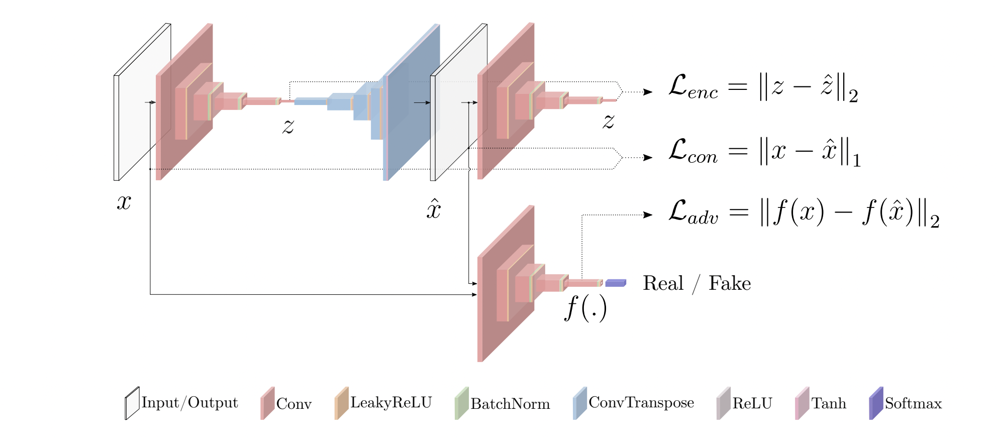

# Car_Damage_Detection_Via_Unsupervised_Generative_Adversarial_Networks
INM363 Individual Project Report for MSc Data Science at the City, University of London (2021-2022)

This repository contains the work products INM363 Individual Project Report for MSc Data Science at the City, University of London (2021-2022).

Abstract: 

The purpose of this project was to solve for anomaly detection problem via an adversarial learning process using a real-world image dataset. The study was focused on the prospect of car damage detection based on the reconstruction of uncorrupted clean samples from any arbitrary image through an unsupervised Generative Adversarial Network (GAN) training process. This work studies car damage detection by researching over two baseline model architectures: GANomaly (Akcay et al., 2018) and SkipGANomaly (Akçay et al., 2019). The aim of this research was to test both models on a much more complex real-world image dataset and improve upon the results to add to the body of knowledge. The research was able to produce a variant of traditional GANomaly methods via the use of advanced training techniques referenced in the previous research literature. Most importantly, a new variant of the SkipGANomaly method was proposed by iteratively projecting arbitrary input towards the clean distribution in the target domain through the introduction of synthetic anomalies in the form of masked regions. By reformulating the original reconstruction task of the SkipGANomaly method as an image completion problem, we were able to produce unprecedented results in successfully completing the masked image regions with the anomaly-free versions. We were able to demonstrate the relevance of our approach with a consistent assessment of the reconstruction-based image completion method, by comparing its performance over a complex client dataset. This study provides substantial proof of concept demonstrating the potential GAN frameworks have to offer towards unsupervised anomaly detection in complex and multifaceted image datasets. 

Keywords: Generative Adversarial Learning, Anomaly Detection, GANomaly, SkipGANomaly, Image Reconstruction, Deep Neural Networks

The dataset used in this project is a proprietary dataset that Tractable AI acquired in 2019 from a third-party software development company. The Nugen dataset contains ~9 million .jpeg images obtained from historic auto collision claim reports. The images are categorised by claim number, each containing multiple photographs of the same vehicle from different vantage points (usually taken by the repair shop or the owner). Each image is given a one-hot-encoded label (1 for True, 0 for False), based on the parts present in each image and whether or not they are damaged. The original raw data is stored in an S3 Object Storage solution offered by Amazon Web Services (AWS). Nugen_dataset folder contains the final list of filenames used in the training (undamaged) and testing (damaged). The csv files of the project matadate of the Nugen dataset is also provided in the Nugen_dataset folder. 

This notebook is based on the original GANomaly architecture proposed by Akcay et al, in 2018 (https://arxiv.org/abs/1805.06725). The model employs DCGAN architecutre (https://arxiv.org/abs/1511.06434) to create a new anomaly detection model using encoder-decoder-encoder sub-networks that generates high-dimensional image space. The model is trained solely on normal data (in our case undamaged car images), and it attemps to map the input image to a representative latent space, which is then used to reconstruct the generated output image. To map the generated image back to its latent representation, additional encoder network is used. The distance between the input image and the generated image, as well as their latent representations, are minimised during training.

- <i>Figure A. GANomaly model architechture with Encoder Decoder and Encoder network and the discriminator. </i>
    
    
The project consists of 5 experiments, each experiment group in different folders. 

